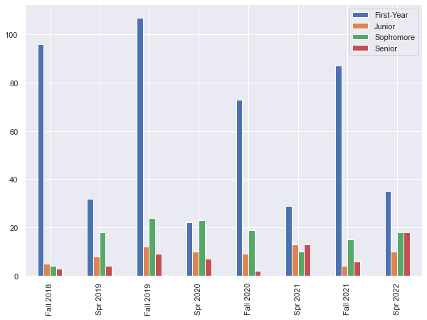
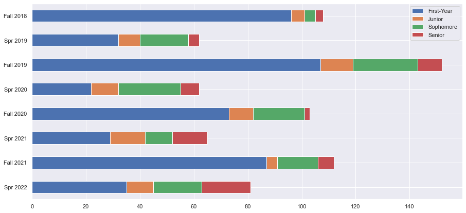
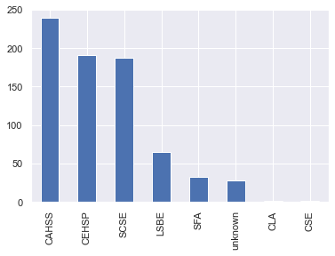
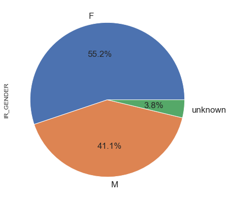
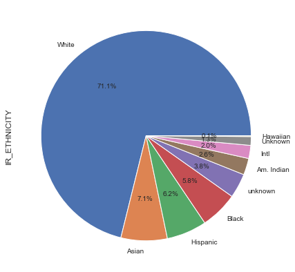
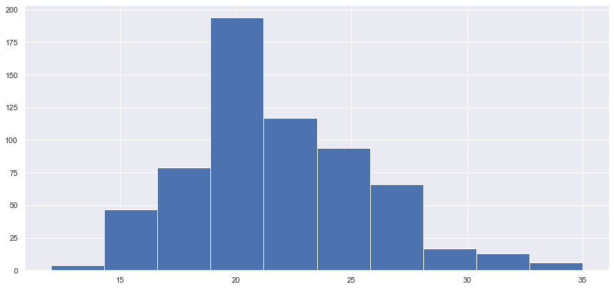

[Back to Boo](../Boo)

```python
import pandas as pd
import numpy as np
import openpyxl
import matplotlib
from matplotlib import pyplot as plt
from matplotlib import rcParams
import seaborn as sns

sns.set()
pd.set_option('mode.chained_assignment', None)  # Suppresses annoying 'pink' slice-copy advisories
```


```python
filename = 'Expanded_Data.csv'
exp_data = pd.read_csv(filename)
print(exp_data.shape)
exp_data.columns
```

    (745, 44)
    


    Index(['Unnamed: 0', 'EMPLID', 'CLASS_TERM_CODE', 'CLASS_TERM_DESCR',
           'CLASSES_TAKEN', '1183_GPA', '1183_CREDITS', '1189_GPA', '1189_CREDITS',
           '1193_GPA', '1193_CREDITS', '1199_GPA', '1199_CREDITS', '1203_GPA',
           '1203_CREDITS', '1209_GPA', '1209_CREDITS', '1213_GPA', '1213_CREDITS',
           '1219_GPA', '1219_CREDITS', '1223_GPA', '1223_CREDITS', 'ENTRY_TERM',
           'ENTRY_INSTITUTION', 'ENTRY_COLLEGE', 'ENTRY_MAJOR', 'DEGREE_TERM',
           'DEGREE_INSTITUTION', 'DEGREE', 'DEG_YEAR_SPAN', 'IR_GENDER',
           'IR_ETHNICITY', 'FGEN_STATUS', 'HS_RANK_PCT', 'COMP_ACT_SCORE',
           'LAST-TERM', 'FINAL_CREDITS', 'ENROLL_STATUS', 'CLASS', 'CLASS_1',
           'CLASS_2', 'CLASS_3', 'GRADES'],
          dtype='object')


### By Class:


```python
terms = ['Fall 2018', 'Spr 2019', 'Fall 2019', 'Spr 2020', 'Fall 2020', 'Spr 2021', 'Fall 2021', 'Spr 2022']
graph_classes = pd.DataFrame()

exp_data['CLASS_TERM_DESCR'].value_counts()

for index_num in range(8):
    temp_df = exp_data[exp_data['CLASS_TERM_DESCR'] == terms[index_num]]
    temp_df['CLASS_STATUS'] = exp_data['CLASS']
    graph_classes[terms[index_num]] = temp_df['CLASS_STATUS'].value_counts()
    stack_me = pd.concat([stack_me, graph_classes[terms[index_num]].to_frame().T], ignore_index=False)

graph_classes.head

graph_classes.plot.bar(figsize=(10,7))
```


    <AxesSubplot: >


    

    


```python
stack_me.plot.bar(figsize=(10,7))
```


    <AxesSubplot: >


    

    


```python
#re_index = ['Spr_22', 'Fall_21', 'Spr_21', 'Fall_20', 'Spr_20', 'Fall_19', 'Spr_19', 'Fall_19']
rev_stack = stack_me.iloc[::-1]
# plotting stacked Horizontal Bar Chart with all the columns
rev_stack.plot.barh(stacked=True, figsize=(15,7))

# display the plotted Horizontal Bar Chart
plt.show()
```


    

    


### By College


```python
by_college = exp_data['ENTRY_COLLEGE'].value_counts()
print(by_gender)

by_college.plot.bar()
```

    F          411
    M          306
    unknown     28
    Name: IR_GENDER, dtype: int64
    


    <AxesSubplot: >


    

    


```python

```


```python

```

### By Gender


```python
by_gender = exp_data['IR_GENDER'].value_counts()
print(by_gender)

by_gender.plot.pie(figsize=(15,7),
           autopct='%1.1f%%', 
           textprops={'fontsize': 17})
```

    F          411
    M          306
    unknown     28
    Name: IR_GENDER, dtype: int64
    


    <AxesSubplot: ylabel='IR_GENDER'>


    

    


```python

```

### By Ethnicity


```python
by_ethnicity = exp_data['IR_ETHNICITY'].value_counts()
print(by_ethnicity)

by_ethnicity.plot.pie(figsize=(15,7),
           autopct='%1.1f%%', 
           textprops={'fontsize': 10})
```

    White         530
    Asian          53
    Hispanic       46
    Black          43
    unknown        28
    Am. Indian     19
    Intl           15
    Unknown        10
    Hawaiian        1
    Name: IR_ETHNICITY, dtype: int64
    


    <AxesSubplot: ylabel='IR_ETHNICITY'>


    

    


```python

```


```python

```

### By First-Generation Status


```python

```


```python

```

### By ACT Score


```python
act_data = pd.to_numeric(exp_data['COMP_ACT_SCORE'],errors='coerce')
print(act_data.shape)
act_data = act_data.dropna()
print(act_data.shape)

act_data = act_data[act_data > 0]
print(act_data.shape)

print(f'Mean composite ACT score: {round((act_data.mean()), 1)}')

act_data.hist(figsize=(15,7))
```

    (745,)
    (717,)
    (637,)
    Mean composite ACT score: 21.8
    


    <AxesSubplot: >


    

    


So the incoming composite ACT score for our students is 21.8, which is significantly lower than the campus average of ~24 depending upon the year.

### By HS Graduation Percentage


```python
act_data = pd.to_numeric(exp_data['COMP_ACT_SCORE'],errors='coerce')
print(act_data.shape)
act_data = act_data.dropna()
print(act_data.shape)

act_data = act_data[act_data > 0]
print(act_data.shape)

print(f'Mean composite ACT score: {round((act_data.mean()), 1)}')

act_data.hist(figsize=(15,7))
```
