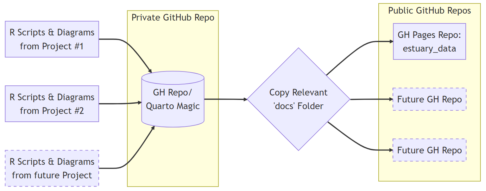

#### Serendipity with scientists

I thought I was going to make some dashboards, instead I had to seriously up my game when it comes to HTML, CSS, YML, Quarto, and Shiny; all while gaining a whole new appreciation for the aesthetic sensibilities of my local biologists.

If you like, you can skip storytime and skip straight to the websites we developed:
* [2021 SWMP Report](https://lake-superior-reserve.github.io/2021-SWMP-Report/)
* [Welcome to the St. Louis River Estuary](https://lake-superior-reserve.github.io/estuary_data/)

 

#### Sam's 5 key takeaways from this project:

-   The quality of [R-Studio's](https://support--rstudio-com.netlify.app) ecosystem likely drives the popularity of R as the language of choice for many scientists.
-   [Quarto](https://quarto.org) is a FABULOUS tool for technical and scientific publishing.
-   There are multiple ways to inject interactivity into the otherwise static world of GitHub Pages.
-   Never underestimate a scientist's passion for aesthetics.
-   Fortune favors the bold; I'm so glad I took a chance...

------------------------------------------------------------------------

# A Little Backstory...

I am not sure what I was expecting. I had boldly walked into the offices of the Lake Superior National Estuarine Research Reserve (LSNERR) on a crisp November afternoon and simply asked, "Do you have any fun data I can play with?" I certainly wasn't expecting a boisterous scientist declaring "You bet we do!"

I had met Hannah earlier that summer at the marina down the road from LSNERR. She was working with some undergraduates on a study to assess a mitigation strategy that marina had adopted to keep nasty chemicals out of the local waterways. I never pass up an opportunity to grill scientists about their work, so a round of 20 questions "hydrology-edition" ensued.

It was the data from study that I was interested in, when I showed up later that fall, but instead Hannah sent me home with some recent publications, some vague directions for downloading a decade or so worth of SWMP (yup, they say "swamp") data, and an appointment to talk further. In short, I was in. Welcome to LSNERR!!!

      

# Project #1: A Better Website than GTMNERR!!

The Lake Superior National Estuarine Research Reserve (LSNERR) is part of [a national network of research reserves coordinated by NOAA.](https://coast.noaa.gov/nerrs/) There are more than 30 reserves scattered across the full expanse of the United States, and LSNERR is one of only two that study freshwater estuaries. The other reserves, including GTMNERR, study saltwater estuaries. 

The Guana Tolomato Matanzas National Estuarine Research Reserve (GTMNERR), in north-eastern Florida, is one of the oldest reserves, and they have the advantage of being able to study their waterway year round (LSNERR's water gets a bit frigid/rigid in mid-winter. In 2022, GTMNERR posted [a user-friendly website](https://gtmnerr.github.io/swmp-quarter-report/) that allows the public to explore some of the more interesting details of their ongoing System-Wide Monitoring Program (SWMP) data. The data is provisional, but the impact was clear: GTMNERR were now clearly the "Cool Kids" of the NERR community, and it was time for LSNERR to one-up their colleagues from down south.

From our first official meeting the charge was clear. We could not allow GTMNERR to have all of the glory, and I was tasked with reverse-engineering the GTMNERR site and using it as the basis for a similar site that LSNERR could use to publish some of their SWMP research to the general public.

 

### Quarto Rules

R is the clear language of choice for a huge proportion of our friends in the scientific community, and the seamless, end-to-end convenience of R-Studio likely has a lot to do with this. Raw data can be cleaned, explored, transformed, and plotted from a single interface. And that interface also handles the integration of those plots & calculations into the kind of LaTeX and markdown documents that many scientific publishers use. R-Studio allows scientists to spend more time thinking about their research, and less time trying to act like software developers.

[Quarto](https://quarto.org) is an open source scientific and technical publishing system that can integrated into R-Studio, and extends its capabilities even further. From R-Studio, Quarto markdown documents can be generated and then exported as websites, online slide presentations, articles, even books!

The folks at GTMNERR chose to use the Quarto "book" template for their website, which gives you a sense of Quarto's flexibility. This template generates navigation bars on both the left and the right sides. For the LSNERR website, Hannah wanted a nav-bar at the top of the page, and a simple table-of-contents for each individual page on the right. And she had some other nifty cards to play aesthetically speaking.

The scientists at LSNERR take their aesthetics very seriously. They understand the subtle impact that carefully chosen fonts and colors can have on their audience, and they had recently worked with a professional graphic designer to compile a design guide for their public-facing documents.

Although Quarto automatically generates the HTML documents that compose the final site, the user can control aesthetic qualities of the finished site using markdown syntax (which can also accept HTML tags), the options controlled by the _quarto.yml file, and the styles.css file.

I had to brush up on CSS (which I had never seriously used before) and on YML (which I had NEVER encountered before), but once that learning curve was squashed, the process of creating a web-based version of [LSNERR's 2021 SWMP Report](https://lake-superior-reserve.github.io/2021-SWMP-Report/) that adhered to the organizational design guide was completely civilized.

  

# Project #2: Expand Project #1

With the first webpage live on GitHub Pages, Hannah started to dream a bit bigger. More pages, more interactivity, MOAR data!!!

The site we planned out for the 2022 data was meant to be explored, not just read, and this required a different approach that would facilitate continuous cycles of revision and expansion.

 

#### Two Repos \> One Repo

I like GitHub Pages, but it has a few quirks, two of which proved annoying. The first headache comes from the need for the critical website documents to be located in either the root folder, or within a "docs" folder at the root level. Quarto has its own ideas about file structures, and this became a problem once our site became more complex.

The solution was to create two GitHub repos. One would be a private repo, and would hold all of the Quarto files and R scripts for the site. When Quarto renders the website itself, the necessary files can then be exported to a GitHub-Pages-friendly "docs" folder. The second repo would be public, and would host the GitHub Pages site. Once Quarto was done spitting out the "docs" folder, it would simply be copied to the public repo and committed. The act of committing the update triggers GitHub Pages to re-render the website.

The advantage to this setup is that it keeps all of our Quarto documents in a single repo, which facilitates collaboration, while making it easy to add multiple public GitHub Page repos as needed. This is a solution that should scale nicely.

 

#### We Needed a Shiny Carousel

The other headache served up by GitHub Pages was the fact that it can only host static webpages, and Hannah wanted dynamic image carousels for many of the site's pages. It is a smart choice; carousels definitely add to the audience's exploratory experience.

[Himeld23](https://github.com/Himeld23/Pure-Css-Carousel) has a simple approach for creating a functional image carousel to a static site, using only HTML and CSS. The idea is to create a series of objects, and then use CSS to  style them with an image as the background. Then it is just a matter of creating links that cycle those objects into the same location. Not a bad hack!

But Quarto REALLY hated this approach. While you can insert HTML snippets into any Quarto markdown document, Quarto ultimately decides how it will convert those snippets into the final HTML file that it generates, and Quarto was NOT looking for anything as complex as the "Pure CSS" approach from Himeld23. Long-story-short, Quarto kept cramming chunks of Himeld23's code inside `
` tags, and then the system would then break down.

Fortunately Quarto does play well with [Shiny](https://shiny.rstudio.com), a package from R-Studio that builds interactive web apps. The documentation and tutorials for this package are excellent, and I had my head wrapped around this process in less than an hour. Shiny does not have an image carousel, but there is a port of [Ken Wheeler's Slick](http://kenwheeler.github.io/slick/) image carousel system into R, and [Stephane Laurent kindly posted a functional Shiny script on Stack Overflow](https://stackoverflow.com/questions/51531743/image-slideshow-in-r-shiny).

This script needs the images be stored in a folder, and Shiny apps generally use a "www" folder for making images available to the app. So we stuck with that convention. Once the app is generated, it needs to be published to an external service such as [shinyapps.io](https://www.shinyapps.io) where the app can be served. That URL is then included in the original Quarto markdown document using an `<iframe>` tag, and voila, you have an interactive image carousel in an otherwise static webpage!

As of this writing, there is still plenty of new content to be added to LSNERR's GitHub Pages site, but the workflow for adding that content is now well established and easy to accomplish. The scientists at LSNERR can stay focused on producing important science, while knowing that THEY are now the Cool Kids on the virtual block. Now it is GTMNERR's turn to play catch-up.

  

**Scientists really seem to have this kind of joyful energy...**  <iframe src="https://giphy.com/embed/ZqlvCTNHpqrio" width="480" height="259" frameBorder="0" class="giphy-embed" allowFullScreen></iframe>

<a href="https://giphy.com/gifs/laughing-despicable-me-minions-ZqlvCTNHpqrio">via GIPHY</a>

