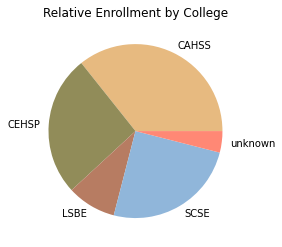

Math is an interesting game that we can teach a human brain to participate in, but if we are being honest, most of us are not nearly as good at it as we think we are. And when we overlook the limitations of human cognition, we can create unforeseen problems for ourselves. That is definitely a troubling thought, but if we start from a place of awe-struck beauty, perhaps we can learn to embrace our limits, and focus our technology on navigating complexity more responsibly.  
 

#### Sam's 5 key takeaways:

-   Our brains are not set up for dealing with numerical complexity.
-   Universities are not little villages, they are more like medium-sized cities.
-   Faculty & Staff of Universities are vertically oriented; students are horizontally oriented.
-   Technology can help us to navigate effectively in both dimensions.
-   "Welcome Week" should be about seeding social connections; orienting students to campus should be handled differently.

------------------------------------------------------------------------

## Backyard Astronomy 101

"As endless as the stars in the night sky" is a common way to poetically invoke infinity. I am fortunate to live northern Minnesota, an area where access to truly dark skies is a luxury I cherish. To lie on the earth on a crisp autumn night, gazing up at that carpet of stars is to understand what the Romantic poets really meant when they started throwing the word "awesome" around. The number of stars you can see surpasses our ability to really comprehend them.

But that is not what infinity actually looks like. We've counted those stars, and the number visible to my human eyes while looking up at the autumn sky in northern Minnesota is not in the millions, it is three orders of magnitude below that. The number of stars visible to the naked eye on any given night under optimal conditions is only around 2,500. But it FEELS infinite. 

2,500 stars.

Our brains were not set up for dealing with complexity.

## We Are Much, Much, More Than a Village...

The University of Minnesota Duluth (UMD), my workplace-home for that last 9 years, is a community of nearly 12,000 students, faculty, staff, and administrators, many of whom assume that we are much much smaller than we really are. Students complain that they were not informed about add/drop dates; faculty colleagues get offended when the administration fails to solicit their opinion about, well everything; I have a friend on the staff who frequently asks "Why can't we just operate like the big family that we are?" Meanwhile, there are more of us, than there are visible stars in the night sky, by a factor of 5! 

We are not a family, or a village; we are more like a decent sized city. The population of Duluth increases by more than 10% when we are in session! Like a city we have our own police force, a parks department, a health care infrastructure, restaurants, a museum, we even have a staff of full-time elevator-repair technicians! We don't act like a family, because that is not logistically possible.

Every August a full "night-sky" worth of new students descends upon our campus to begin their educational experience, and over the course of their first week on our campus, we firehose them with information about every service available to them, every opportunity that they should seize, and every expectation others will have for them. And then we complain that they don't seem to retain it all. We are probably doing this wrong...

## We Are Living in Different Dimensions...

As a faculty member, my world at UMD is oriented rather vertically. My students and research assistants are below me, my department head and the myriad layers of beauocracy are above me; I have a few colleagues that share my horizontal millieu, but the complexity in my working life is in that vertical structure. The life of a student at UMD is VERY different. Their peers form the overwhelming majority of their daily contacts, and they interact with the full breadth of the university's diverse structural units. They take classes from multiple departements in multimple colleges. They shop, eat, go to the gym, meet with a therapist, fight with a roommate, all within the bounds of the University; I'm lucky if I leave my office most days... It is little wonder that faculty & staff struggle to find ways to introduce students to the complexities of University life; we don't fully comprehend those complexities ourselves.

## Better Living Through Data Filtering

One of the most challenging parts of data analysis is finding effective ways to communicate the insights gleaned from gigabytes of data to stakeholders whose priorities lie elsewhere. It is worth remembering that as a species, we have a long history of coming up with tools for expressing complexity more efficiently. 

Numbers help. Writing something like **1082** is much less daunting than trying to point to the number of atoms in all the stars in all of the 100 billion+ galaxies in the entirety of the known universe. 

Charts are even better.

I could write out the dataframe that this chart is depicting, but no human brain could ever "see" these ratios in that avalanche of numbers. We all grew up looking at visual models of our solar system, and now anyone with an elementary school education easily understands the relative movements of planets around the sun. But if you really want a challenge, try heading out into that crisp autumnal night and try to literally see the physical layout of solar system in the world before your eyes. Most people are lucky if they can figure out which bright thing is a planet, vs a star. The fact that Copernicus and those that followed worked the whole thing out while writing with a bit of feather boggles my mind.

## What We Really Need Technology For

The value in technology is about making connections and communicating abstractions. Those of us who enjoy writing code and developing algorithms can create virtual tools to help stakeholders to "see" the pie chart in the data. Computational power and consistency is similarly important, but those computations are rarely the end result; they serve to support a subsequent abstraction. 

Those abstractions (exponential notation, pie charts, solar-system diagrams) are so important to us, it is hard to imagine how we ever could have gotten along without them. Our task as data scientists is to CREATE those abstractions from the oceans of data in which we swim, and our technological tools from Pandas to Tableau help us to create them.

Our colleges and universities are, for most people, the largest and most complex institutions that they will ever interact with. There is an untapped opportunity there for some bright minds to implement technological solutions to make that complexity more managable for the facutly and staff who work there, and for the students who live there.

We should probably start with rethinking Welcome Week...