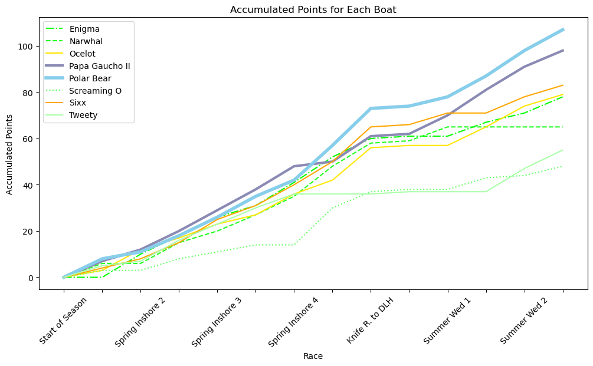

Sailing is a strange world. It seems so simple. It's not. I am spellbound by sailing because of its complexity, and I am famous on my crew for nerding out about minutae that does not always make much difference in the race results. Knowing where to focus your efforts requires more experience than I have. I'm just the data nerd, my job is to provide timely information to the others on my team with more experience, so that they can make better decisions.
 

#### Sam's 5 key takeaways:

-   Color matters, a lot. It is perhaps the most useful way to draw visual focus.
-   Line-weights are more subtle, but contribute to that focus.
-   You can use a chart to illustrate a specific and focused argument.
-   That same chart should contain enough information to fuel intelligent discussions on that same topic.
-   Clear is better than pretty

------------------------------------------------------------------------

## Boat of the Year

The **Duluth Yacht Club (DYC)** is not a yacht club in the cinematic sense. It is not based in a specific marina that carries its name, no one is wearing blue blazers, and anyone can join. Membership costs $100/year. I blew $100 the last time I took my family bowling. This is a racing club, with some low-key drinking after the Wednesday night races.

Each year the DYC organizes a series of more than 30 races between mid-May and mid-September. Half of those races happen on Wednesday night, and are relatively short "buoy races," which attract the largest fleets. The other half of the races are split between longer "inshore" races and a series of "offshore" races that are the longest of all. Those races are clustered into 6 series as follows:

-   Wednesday Night Spring Series (6 races)
-   Spring Inshore Series (4 races)
-   Wednesday Night Summer Series (4 races)
-   Wednesday Night Fall Series (6 races)
-   Fall Inshore Series (4 races)
-   Offshore Series (8 races)

Boats and their crews score points in each race according to their finishing order, and awards are given for the top three boats in each series. But across the entire season points are also given in the **Boat of the Year** competition. Most crews do not actively pursue the Boat of the Year title for reasons that will soon become clear, but this year the boat I crew on, **Polar Bear**, is most definitely in the hunt.

<figure>
  
  <figcaption>Fig. 1 - Polar Bear at full-cry</figcaption>
</figure>

## Let's Build a Chart

Race results are posted on the DYC website, and the standings in each series are updated after each race. The season-long progress toward the Boat of the Year, on the other hand is not tracked publically, which leaves data-junkies like myself to track things on our own.

I have been collecting Boat of the Year data on 8 boats in our fleet. Those boats include the three of the recent Boat of the Year winners, as well as a handful of other boats who are actively competing in all of the series on the schedule.

The Boat of the Year competition is scored very differently from the other series. In a Wednesday night series, for example, you collect points based on your finishing order (1pt for 1st place, 4pts for 4th place, etc.), with the worst single result dropped from the final calculation. The lowest scores win the series. Boat of the Year, on the other hand is scored quite differently. No scores are dropped, and boats score points according to both how they finish in their fleet, as well as the **size** of that fleet. So if a boat places first out of a fleet of 8 boats, they would score 9 points, with second place scoring 8 points, and so on. But if a boat wins in a fleet of 4 boats, then they would only score 5 points. This leads to a great deal of confusion as a clear understanding of how many boats actually compete in each fleet in a given race is often unclear to those out on the water.

At the midpoint of the season my spreadsheet looks like this:

     

All of the data thay you could ever want is right there! But that table is not doing a great job of telling the story of the first half of the season. This would be a fine time for a line chart that shows the accumulation of points for the season thus far:

     

This is about as boiler-plate as charts come; pure Plotly. The colors are pretty, and if you show this to people it is such a HUGE leap up from the spreadsheet table that you will generally get a positive response. But this could be better...

## Let's Build a Better Chart

For starters, the chart is too narrow, you can't even read the labels on the x-axis. Adding `figsize=(12,6)` to the initial plot constructor makes a big difference already:

     

My biggest issue with this line chart is the use of color. These colors are bright and easy to read, but **they don't mean anything** aside from identifying which boat goes with each line. 

These colors are not helping to tell the story of the competition at this point in the season. If we assume that my audience for this chart is my skipper and the rest of the crew, then the fate of Polar Bear and its near-competitors matters more than the fate of most of the other boats. 

<figure>
  
  <figcaption>Fig. 2 - Papa Gaucho II in downwind mode.</figcaption>
</figure>

Contrast will be important here, but so will connotation. Most of Polar Bear's spinnakers and decrorative accents are blue (fig 1), and her deck is painted light blue. So her line on the chart should be blue. Our nearest competitor sprouts a purple spinnaker (fig 2) for her downwind runs, so Papa Gaucho II's line should be purple. The other boats matter less. I'm going to make the next two closest competitors stand out a little as we are "keeping and eye" on them, but the other four boats matter much less. So let's keep their data there, but lets make it receed into the background:

     

The most important part of the story of the season is becoming much more clear. Polar Bear is leading the competition, with Papa Gaucho II close behind. Sixx and Ocelot are up there, and the other boats are almost background noise.

Adjusting the line weights for Polar Bear and Papa Gaucho II further increases the emphasis on the two most important boats in this story, and varying the line style for the green lines makes it easier to track those individual boats:

     

Now it is time to solve some problems. The scale at the bottom is showing the different race events, but half of them are missing. Matplotlib is treating this axis like it is labeled with integers and we don't need to see everyone of those. This code will give us the correct number of ticks on the x-axis: 

`plt.xticks((np.arange(len(df_accumulated.index), step=1)), rotation=45)`

The last part of that method call will also tilt the text on a visually pleasing 45 degree angle so that they don't crowd one another quite so much.

     

We are still missing labels, but this code will fix that:

`ax = plt.gca()
ax.set_xticklabels(list(df_accumulated.index))`

     

One final tweak; the 45 degree angle of the text lables lead my eye to think that the end of the word is where the text should be, which is rather imprecise. Changing the rotation to 90 degrees is less visually elegant, but more precise and thus more useful:

     

This final chart is not only prettier than the Plotly boilerplate, but it communicates the story of the season much more effectively. In a presenation I could use this chart to illustrate the following observations:
-   We have clearly pulled ahead in this competition, but Gaucho is not far behind. We need to keep racing, and racing well. This is **not** the time to take our foot of the gas.
-   That pair of offshore races to and from Knife River (where we took 2nd & 1st) really catapaulted us to the top of the heap. This is why they say, if you want to win Boat of the Year, **you need to race the entire calendar!**
-   Tweety and Narwhal serve as the counter-example. Both boats were in the hunt from the start, but then their lines went flat for a few weeks when they skipped multiple races. It would be extremely difficult for those boats to catch back up at this point. You need to race the entire calendar to win Boat of the Year.
-   Of course, that last point deserves a chart that tells its story a bit more clearly. Perhaps we will just adjust the line-weights:

     

The season is far from over, and with the weather getting ever-warmer, the fleets will get bigger for each race, which means that more Boat of the Year points will be scored in the second half of the season relative to the first half of the season.

Fair winds and following seas to my fellow crewmates on Polar Bear. At least we know where we stand.