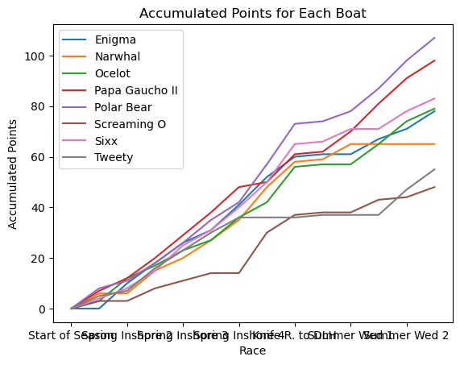
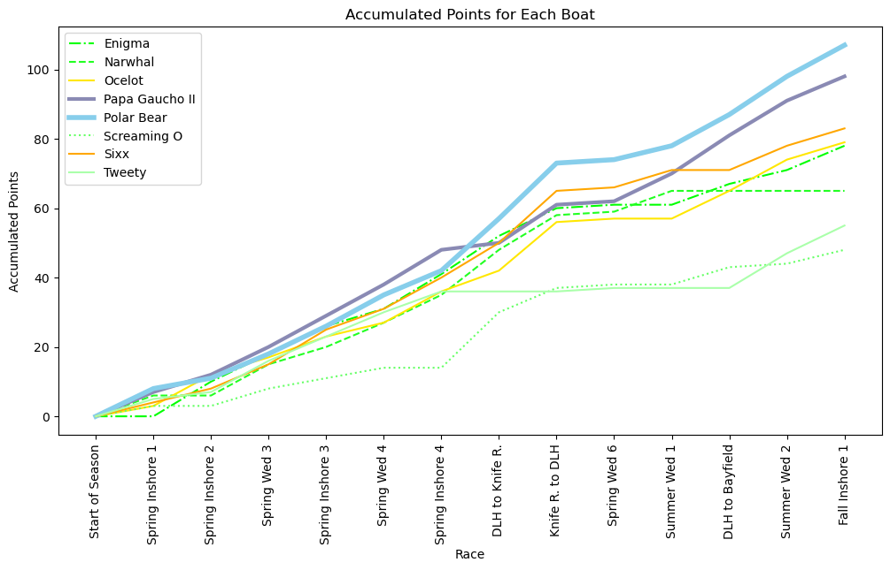

In an ideal world those of us working with data would have frictionless access to our data warehouses, and the data engineering behind those troves of data would be modern, efficient, and user friendly. I don't live there either. Here's what I'm doing to get by...

I coordinate a program that consists of a course taken by 2/3 of our University, split across ~50 separate class sections. For logistial purposes I need accurate rosters detailing which students are in which sections, along with email addresses and other details that enable me to circulate the surveys and other tools that we use to keep tabs on how the program is going. Obtaining those "accurate rosters" has proven challenging over the years, and many different approaches have been used including:
- **Having faculty send me a copy of their rosters** (lots of mistakes, inconsistent response times)
- **Direct data-request from the folks who run our data-warehouse** (can take up to a week, we pay a fee for every data pull)
- **I copy/paste the data from the learning management system using my administrative access privileges** (Incomplete data, time-consuming & error-prone process)
- **Collect missing data from student reponses to surveys** (error-prone, some students don't do the survey)

## The Mission:
What I need is the ability to pull a complete set of data on the students in my program multiple times throughout the semester so that we can reliably communicate with them even as they add and drop classes; this is particulary important in the early weeks of the semester.

## The Plan:
The good news is that I have access to all of the data, I just don't have the authority to access that data using something efficient as a SQL query. I have to click through page after page in the online interface, which is mindless, and repetitive, and error-prone,  and exactly the sort of thing that a web-scraper can do far more accurately and efficiently!

#### Step-By-Step
**The Tools:** My package of choice for this task is Selenium. One day I will learn to do these sorts of things with Perl, but here Python lives up to its reputation as the perpetually "good enough" language. Using the Selenium Web Driver I can navigate through all of those same clicks, and collect the desired data along the way into a Pandas DataFrame, and later into an Excel file.

 

Result

 

  
  &nbsp; &nbsp; &nbsp; &nbsp; <!-- This is for spacing between images -->
  

  <strong><em>Figure 1: How it started...</em></strong>
  &nbsp; &nbsp; &nbsp; &nbsp; &nbsp; &nbsp; &nbsp; &nbsp; &nbsp; &nbsp; &nbsp; &nbsp; &nbsp; &nbsp; &nbsp; &nbsp; <!-- This is for spacing between captions -->
  <strong><em>Figure 2: How it's going...</em></strong>

